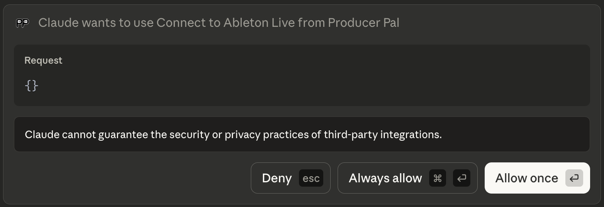
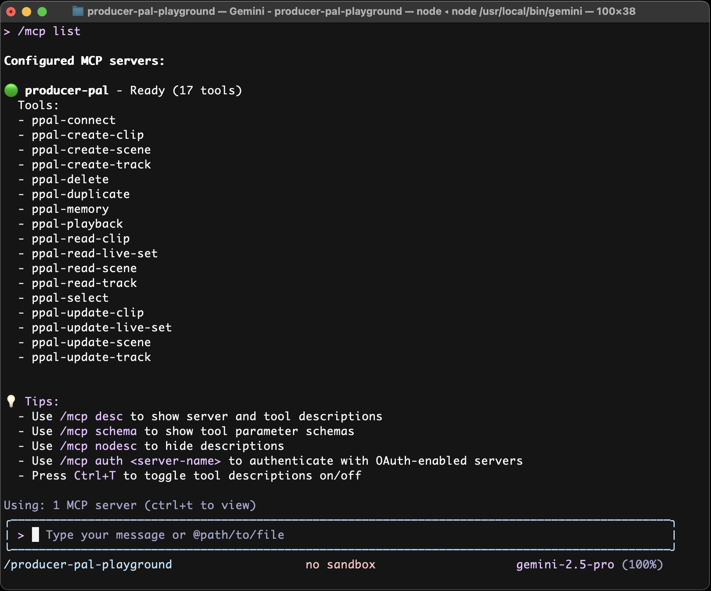

# <sub></sub> Producer Pal Installation Guide

Choose your AI for installation steps:

- ⭐️ [Claude Desktop](#claude-desktop) - Anthropic's desktop GUI - easiest
  setup
- ⭐️ [Gemini CLI](#gemini-cli) - Google's command line agent - generous free
  tier
- [Codex CLI](#codex-cli) - OpenAI's command line agent
- [Claude Code](#claude-code) - Anthropic's command line agent
- [claude.ai Web App](#claudeai-web-app) - Anthropic's web app
- [ChatGPT Web App](#chatgpt-web-app) - OpenAI's web app
- [LM Studio](#lm-studio) - Run models completely offline
- [Other MCP-compatible LLMs](#other-mcp-compatible-llms)

_⭐️ indicates recommended options_

Already installed and it doesn't work? Try the
[Troubleshooting Guide](#troubleshooting).

<br>

## Claude Desktop

Anthropic's Claude Desktop app is the easiest, recommended way to use Producer
Pal.

### Requirements

- [Ableton Live 12.2+](https://www.ableton.com/live/) with
  [Max for Live](https://www.ableton.com/live/max-for-live/)
- [Claude Desktop](https://claude.ai/download) (requires Anthropic account)

### Installation

1. Download
   [Producer_Pal.amxd](https://github.com/adamjmurray/producer-pal/releases/latest/download/Producer_Pal.amxd),
   the Producer Pal Max for Live device, and add it to a MIDI track in Ableton
   Live:

   

   _It should display "Producer Pal Running" or something isn't working._

2. Download the
   [Producer Pal Claude Desktop Extension (`Producer_Pal.mcpb`)](https://github.com/adamjmurray/producer-pal/releases/latest/download/Producer_Pal.mcpb)

3. Go to Claude Desktop &rarr; Settings &rarr; Extensions and:

   3a. If you already have extensions installed, drag and drop
   `Producer_Pal.mcpb` into the Extensions screen:

   

   3b. Or, if you have never installed a Claude Desktop extension before, you
   need to click "Advanced settings" on the Extensions screen, then click
   "Install extension...", and choose the
   [Producer_Pal.mcpb](https://github.com/adamjmurray/producer-pal/releases/latest/download/Producer_Pal.mcpb)
   file.

    

4. Don't forget to click "Install" and complete the Claude Desktop installation:

   

5. You should see Producer Pal tools in Claude's "Search and Tools" menu (make
   sure it's enabled when starting a conversation):

   

6. Start a conversation with "connect to ableton"

7. Allow Producer Pal tools to be used when Claude tries to use them:

   

   

If it doesn't work, see the [Troubleshooting Guide](#troubleshooting).

<br><br>

## Gemini CLI

Use Producer Pal with Google's command line coding assistant. No subscription
needed.

### Requirements

- [Ableton Live 12.2+](https://www.ableton.com/live/) with
  [Max for Live](https://www.ableton.com/live/max-for-live/)
- [Node.js 20+](https://nodejs.org/en/download)
- [Gemini CLI](https://github.com/google-gemini/gemini-cli?#-installation)
  (requires Google account)

### Installation

1. Download
   [Producer_Pal.amxd](https://github.com/adamjmurray/producer-pal/releases/latest/download/Producer_Pal.amxd),
   the Producer Pal Max for Live device, and add it to a MIDI track in Ableton
   Live:

   

   _It should display "Producer Pal Running" or something isn't working._

2. Add Producer Pal to Gemini's settings in `~/.gemini/settings.json`:

   **Option A: With producer-pal-portal.js (recommended)**:

   Download
   [producer-pal-portal.js](https://github.com/adamjmurray/producer-pal/releases/latest/download/producer-pal-portal.js)
   and configure:

   ```json
   {
     "mcpServers": {
       // ... other MCP server configs ...
       "producer-pal": {
         "command": "node",
         "args": ["/absolute/path/to/producer-pal-portal.js"]
       }
     }
   }
   ```

   **Option B: Direct HTTP**

   ```json
   {
     "mcpServers": {
       // ... other MCP server configs ...
       "producer-pal": {
         "httpUrl": "http://localhost:3350/mcp"
       }
     }
   }
   ```

   _When using direct HTTP, start Ableton Live with Producer Pal before Gemini
   CLI._

3. Run `gemini` to start the Gemini CLI in an empty folder (so it can focus on
   Producer Pal instead of coding)

4. Run `/mcp list` in the Gemini CLI to confirm the Producer Pal tools are
   available:

   

5. Start a conversation with "connect to ableton"

6. Allow Producer Pal tools to be used when Gemini tries to use them:

   

   

If it doesn't work, see the [Troubleshooting Guide](#troubleshooting).

<br><br>

## Codex CLI

Use Producer Pal with OpenAI's command line coding assistant.

### Requirements

- [Ableton Live 12.2+](https://www.ableton.com/live/) with
  [Max for Live](https://www.ableton.com/live/max-for-live/)
- [Node.js 22+](https://nodejs.org/en/download)
- [OpenAI Codex](https://github.com/openai/codex#quickstart) (requires OpenAI
  account, and a paid subscription at time of writing)

### Installation

1. Download
   [Producer_Pal.amxd](https://github.com/adamjmurray/producer-pal/releases/latest/download/Producer_Pal.amxd),
   the Producer Pal Max for Live device, and add it to a MIDI track in Ableton
   Live:

   

   _It should display "Producer Pal Running" or something isn't working._

2. Add Producer Pal to Codex's settings in `~/.codex/config.toml`:

   **Option A: With producer-pal-portal.js (recommended)**:

   Download
   [producer-pal-portal.js](https://github.com/adamjmurray/producer-pal/releases/latest/download/producer-pal-portal.js)
   and configure:

   ```toml
   [mcp_servers.producer-pal]
   command = "node"
   args = ["/absolute/path/to/producer-pal-portal.js"]
   ```

   **Option B: Direct HTTP**

   ```toml
   [mcp_servers.producer-pal]
   url = "http://localhost:3350/mcp"
   ```

   _When using direct HTTP, start Ableton Live with Producer Pal before Codex
   CLI._

3. Run `codex` in an empty folder (so it can focus on Producer Pal instead of
   coding)

4. Run `/mcp` in the Codex CLI to confirm the Producer Pal tools are available:

   

5. Start a conversation with "connect to ableton"

   

If it doesn't work, see the [Troubleshooting Guide](#troubleshooting).

<br><br>

## Claude Code

Use Producer Pal with Anthropic's command line coding assistant.

### Requirements

- [Ableton Live 12.2+](https://www.ableton.com/live/) with
  [Max for Live](https://www.ableton.com/live/max-for-live/)
- [Node.js 20+](https://nodejs.org/en/download)
- [Claude Code](https://www.anthropic.com/claude-code) (requires Anthropic
  account, and a paid subscription at time of writing)

### Installation

1. Download
   [Producer_Pal.amxd](https://github.com/adamjmurray/producer-pal/releases/latest/download/Producer_Pal.amxd),
   the Producer Pal Max for Live device, and add it to a MIDI track in Ableton
   Live:

   

   _It should display "Producer Pal Running" or something isn't working._

2. Configure Claude Code to use Producer Pal:

   **Option A: With producer-pal-portal.js (recommended)**:

   Download
   [producer-pal-portal.js](https://github.com/adamjmurray/producer-pal/releases/latest/download/producer-pal-portal.js)
   and run:

   ```bash
   claude mcp add producer-pal -- node /absolute/path/to/producer-pal-portal.js
   ```

   **Option B: Direct HTTP**

   ```bash
   claude mcp add --transport http producer-pal http://localhost:3350/mcp
   ```

   _When using direct HTTP, start Ableton Live with Producer Pal before Claude
   Code._

3. Start Claude Code by running `claude` in an empty folder (so it can focus on
   Producer Pal instead of coding)

4. Run `/mcp` in Claude Code to confirm the Producer Pal tools are available:

   

   

5. Start a conversation with "connect to ableton"

6. Allow Producer Pal tools to be used when Claude tries to use them:

   

   

If it doesn't work, see the [Troubleshooting Guide](#troubleshooting).

<br><br>

## claude.ai Web App

Use Producer Pal in your web browser with Anthropic's chat web app.

### Requirements

- [Ableton Live 12.2+](https://www.ableton.com/live/) with
  [Max for Live](https://www.ableton.com/live/max-for-live/)
- [Claude account](https://claude.ai)
- [Web tunnel](#web-tunnels) (e.g., ngrok or Pinggy)

### Installation

1. Download
   [Producer_Pal.amxd](https://github.com/adamjmurray/producer-pal/releases/latest/download/Producer_Pal.amxd),
   the Producer Pal Max for Live device, and add it to a MIDI track in Ableton
   Live:

   

   _It should display "Producer Pal Running" or something isn't working._

2. Set up [a web tunnel](#web-tunnels) to expose your local Producer Pal server,
   for example:

   ```bash
   ngrok http http://localhost:3350
   ```

   This gives you a public URL like `https://1234abcd.ngrok-free.app`

3. Go to [claude.ai settings](https://claude.ai/settings/connectors)
4. Add a Custom Connector with your tunnel URL + `/mcp`:
   ```
   https://1234abcd.ngrok-free.app/mcp
   ```
5. Start a conversation with "connect to ableton"

If it doesn't work, see the [Troubleshooting Guide](#troubleshooting).

<br><br>

## ChatGPT Web App

Use Producer Pal in your web browser with OpenAI's chat web app.

### Requirements

- [Ableton Live 12.2+](https://www.ableton.com/live/) with
  [Max for Live](https://www.ableton.com/live/max-for-live/)
- [ChatGPT account](https://chatgpt.com) (at the time of writing, a paid
  subscription is required to access the advanced settings needed for this to
  work)
- [Web tunnel](#web-tunnels) (e.g., ngrok or Pinggy)

### Installation

1. Download
   [Producer_Pal.amxd](https://github.com/adamjmurray/producer-pal/releases/latest/download/Producer_Pal.amxd),
   the Producer Pal Max for Live device, and add it to a MIDI track in Ableton
   Live:

   

   _It should display "Producer Pal Running" or something isn't working._

2. Set up [a web tunnel](#web-tunnels) to expose your local Producer Pal server,
   for example:

   ```bash
   ngrok http http://localhost:3350
   ```

   Note your public URL (e.g., `https://1234abcd.ngrok-free.app`)

3. Go to [ChatGPT](https://chatgpt.com) → Settings
4. Enable Developer Mode
5. Add a Custom Connector:
   - URL: Your tunnel URL + `/mcp` (e.g., `https://1234abcd.ngrok-free.app/mcp`)
   - No authentication required
   - Trust the connector
6. Start a new chat with Developer Mode and Producer Pal explicitly enabled and
   say "connect to ableton"

If it doesn't work, see the [Troubleshooting Guide](#troubleshooting).

<br><br>

## LM Studio

Use Producer Pal completely offline without an Internet connection.

### Requirements

- [Ableton Live 12.2+](https://www.ableton.com/live/) with
  [Max for Live](https://www.ableton.com/live/max-for-live/)
- [LM Studio](https://lmstudio.ai/)

**⚠️ Experimental:** This requires a relatively new machine with decent specs
(Apple Silicon with lots of RAM or PCs with Nvidia 4080+ graphics cards). It
requires more technical know-how to setup and debug. The online options
documented above work significantly better and faster at the time of writing.
However, completely offline and private usage is compelling.

### Installation

1. Download
   [Producer_Pal.amxd](https://github.com/adamjmurray/producer-pal/releases/latest/download/Producer_Pal.amxd),
   the Producer Pal Max for Live device, and add it to a MIDI track in Ableton
   Live:

   

   _It should display "Producer Pal Running" or something isn't working._

2. Optional / Recommended: In Producer Pal's "Advanced" tab, enable "Small Model
   Mode":

   

   _This option is disabled by default and must be enabled each time you add
   Producer Pal to Live._

3. Install a compatible model in LM Studio, such as:
   - Qwen 3+ (4b-2507, 4b-thinking-2507)
   - OpenAI GPT-OSS (20B)
   - Mistral AI Magistral (small-2509)
   - Granite 4+ (4.0-h-tiny)
4. Setup Producer Pal in LM Studio Settings → Program → Integrations → edit
   mcp.json:

   **Option A: With producer-pal-portal.js (recommended)**:

   Download
   [producer-pal-portal.js](https://github.com/adamjmurray/producer-pal/releases/latest/download/producer-pal-portal.js)
   and configure:

   ```json
   {
     "mcpServers": {
       // ... other MCP server configs ...
       "producer-pal": {
         "command": "node",
         "args": ["/absolute/path/to/producer-pal-portal.js"]
       }
     }
   }
   ```

   **Option B: Direct HTTP**

   ```json
   {
     "mcpServers": {
       // ... other MCP server configs ...
       "producer-pal": {
         "url": "http://localhost:3350/mcp"
       }
     }
   }
   ```

   _When using direct HTTP, start Ableton Live with the Producer Pal device
   before enabling the Producer Pal MCP server inside LM Studio._

5. Confirm the Producer Pal tools are listed under Settings → Program:

   

6. Start a conversation with Producer Pal MCP active and say "connect to
   ableton"

7. If you didn't enable "Allow all" under Settings → Program, then allow
   Producer Pal tools in the conversation:

   

   

If it doesn't work, see the [Troubleshooting Guide](#troubleshooting).

### Optimizing for Local Models

- A **context length of about 8k (8000)** is needed to start a conversation with
  Producer Pal and send a few messages.
- A **context length of 16k (16000) or higher is recommended** for achieving
  useful results, but higher context lengths can make the model run
  significantly slower, especially as the conversation grows. Experiment to find
  the right balance.
- To get more out of a limited context length, disable some of the Producer Pal
  tools. A reasonable minimal toolset for experimentation is:
  - `ppal-connect`
  - `ppal-read-live-set`
  - `ppal-create-clip`
  - `ppal-read-clip`
  - `ppal-update-clip`
  - `ppal-playback`

  Try disabling all the other tools and add back when you miss features.

- If the AI struggles and makes mistakes, don't hesitate to delete recent
  messages from the chat, edit your last message, and try again. Don't waste
  tokens correcting the LLM. Back up and avoid the issue or try something else.
- Shut down every other app you don't need to be running
- Consider running Ableton Live on a different machine on the local network
- When using a model with the GGUF engine, try enabling the
  advanced/experimental settings for Flash Attention and setting the K/V caches'
  quantization to Q8 or Q4.
- Research how to optimize for your specific machine / GPU hardware

### Advanced: Customizing for Your Model

Local models vary widely in capabilities. **First, try enabling "Small Model
Mode" in Producer Pal's Advanced tab** (see LM Studio installation step 2
above) - this uses a simplified instruction set designed for smaller models.

If Small Model Mode isn't working well for you, or you want to experiment
further, you can customize Producer Pal's behavior for your specific model:

1. Download this repository and follow the dev setup and build instructions in
   [DEVELOPERS.md](./DEVELOPERS.md)
2. Edit `src/skills/basic.js` - the skills file used by Small Model Mode (or
   edit `src/skills/standard.js` to adjust regular mode)
3. Experiment with instruction wording, remove features your model struggles
   with, or adjust the guidance
4. Rebuild with `npm run build`
5. Reload your Producer Pal MCP server in LM Studio and start a new conversation

<br><br>

## Other MCP-compatible LLMs

Producer Pal works with any LLM that supports the Model Context Protocol (MCP).

### Requirements

- [Ableton Live 12.2+](https://www.ableton.com/live/) with
  [Max for Live](https://www.ableton.com/live/max-for-live/)
- AI that supports [MCP](https://modelcontextprotocol.io)
- Potentially: [Node.js 20+](https://nodejs.org/en/download)

### Installation

Download
[Producer_Pal.amxd](https://github.com/adamjmurray/producer-pal/releases/latest/download/Producer_Pal.amxd),
the Producer Pal Max for Live device, and add it to a MIDI track in Ableton
Live:

   

_It should display "Producer Pal Running" or something isn't working._

Then, configure your AI to connect to Producer Pal using one of the following
methods.

#### Option A: Local MCP via stdio (recommended)

Download
[producer-pal-portal.js](https://github.com/adamjmurray/producer-pal/releases/latest/download/producer-pal-portal.js)
and configure your LLM MCP to use:

```bash
node /path/to/producer-pal-portal.js
```

This option requires [Node.js 20+](https://nodejs.org/en/download).

#### Option B: Local MCP via HTTP

Use the URL:

```
http://localhost:3350/mcp
```

Sometimes an additional setting is needed for HTTP connections. For example,
[Cline](https://cline.bot/) requires `"type": "streamableHttp"` to be configured
along with the `url`.

In some apps, the `/mcp` path might need to be omitted from the URL. It is
typically present.

You may need to restart your AI app or refresh MCP servers if you forgot to run
Ableton Live with Producer Pal Max first.

#### Option C: Remote MCP via HTTP tunnel

For cloud-hosted LLMs or remote access:

1. Set up a [web tunnel](#web-tunnels) (e.g., ngrok, Pinggy)
2. Configure your LLM with the public URL + `/mcp`

In some apps, the `/mcp` path might need to be omitted from the URL. It is
typically present.

<br><br>

## Web Tunnels

For remote access to Producer Pal from the Internet, you'll need a tunneling
service.

**⚠️ Security:** Producer Pal has no authentication. Anyone with your tunnel URL
can control Ableton Live. Keep the URL secret and only share with trusted
collaborators. If someone discovers it, restart your tunnel to get a new URL.

**For local networks** (studios, classrooms, performances): You don't need a
tunnel. Customize the port number in the Producer Pal device settings
(default: 3350) to prevent unauthorized access from other devices on the same
network. Update the `:3350` in your AI connection settings if you change it in
the Producer Pal Max for Live device.

### ngrok (Recommended)

- [Sign up](https://ngrok.com) for persistent URLs (paid) or use free tier with
  changing URLs
- Install: `brew install ngrok` (macOS) or download from website
- Run: `ngrok http http://localhost:3350`

### Pinggy

- No installation required on macOS
- Run: `ssh -R 80:localhost:3350 a.pinggy.io`
- Free tier limited to 60 minutes

<br><br>

## Troubleshooting

### AI won't use Producer Pal

Verify your setup:

- Producer Pal Max for Live device is running in Ableton Live and displays
  "Producer Pal Running"
- Producer Pal tools are enabled in your AI app (most apps let you view
  available MCP tools/extensions)
- If either was missing, start a new conversation. If that doesn't work, restart
  your AI app completely.

If the AI claims it can't interact with Ableton Live:

1. Ask "what tools do you have?"
2. Verify it lists Producer Pal tools like `ppal-connect`
3. Say "call your ppal-connect tool"

Once ppal-connect is called, Producer Pal should work. If "connect to ableton"
doesn't trigger it, try:

- "connect to ableton with your tools"
- "connect to ableton with your ppal-connect tool"

If tools are visible but the AI won't call them, check you're using a model that
supports tool calling. Many local models (including some in LM Studio) don't
support tools.

### Connection Issues

- Ensure Producer Pal device is loaded and running in Ableton Live
- Check that port 3350 is not blocked by firewall
- For remote connections, verify your tunnel is active

### MCP Server Not Found

- Verify the full path to `producer-pal-portal.js` is correct
- Ensure Node.js is installed and accessible from your terminal

### Tools Not Appearing

- Toggle the Producer Pal device off and on in Live
- Restart your AI interface
- Check the Max console for error messages

### Getting Support

- Ask in
  [the discussion forum](https://github.com/adamjmurray/producer-pal/discussions/categories/questions)
- Report bugs in
  [the bug reports forum](https://github.com/adamjmurray/producer-pal/discussions/categories/bug-reports)
  or [issues list](https://github.com/adamjmurray/producer-pal/issues)
- Documentation: See [the README](./README.md) and
  [developer documentation](./DEVELOPERS.md).
