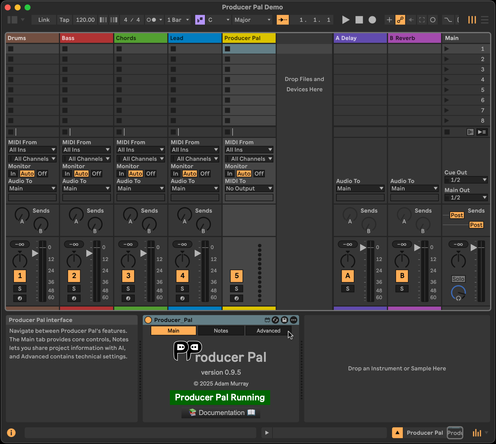

# Producer Pal Installation Guide

1. Add the
   [Producer Pal Max for Live device (`Producer_Pal.amxd`)](https://github.com/adamjmurray/producer-pal/releases/latest/download/Producer_Pal.amxd)
   to your Ableton Live project
   - Requires [Ableton Live 12.2+](https://www.ableton.com/live/) with
     [Max for Live](https://www.ableton.com/live/max-for-live/) (e.g. Ableton
     Live Suite)
   - Add the device to a MIDI track, ideally an empty one:
     

2. Connect an AI model to Producer Pal:
   - [Anthropic Claude](#anthropic-claude-installation)
     - [Claude Desktop](#claude-desktop)
     - [Claude Code](#claude-code)
     - [claude.ai Web App](#claudeai-web-app)
   - [Google Gemini](#google-gemini)
     - [Gemini CLI](#gemini-cli)
   - [OpenAI](#openai)
     - [Codex CLI](#codex-cli)
     - [ChatGPT web app](#chatgpt-web-app)
   - [LM Studio](#lm-studio) (local models, no Internet required)
   - [Other MCP-compatible LLMs](#other-mcp-compatible-llms)

3. Start a conversation with "let's play with ableton live"

If it doesn't work, see the [troubleshooting guide](#troubleshooting).

## Anthropic Claude Installation

No subscription is required to use Claude, but you must register an Anthropic
account and
[verify the account with a phone number](https://support.anthropic.com/en/articles/8287232-why-do-i-need-to-verify-my-phone-number).

### Claude Desktop

Claude Desktop is the easiest way to use Producer Pal with Claude.

1. Install [Claude Desktop](https://claude.ai/download)

2. Download the
   [Producer Pal Claude Desktop Extension (`Producer_Pal.mcpb`)](https://github.com/adamjmurray/producer-pal/releases/latest/download/Producer_Pal.mcpb)

3. Go to Claude Desktop &rarr; Settings &rarr; Extensions and:

   3a. If you already have extensions installed, drag and drop
   `Producer_Pal.mcp` into the Extensions screen:

   

   3b. Or, if you have never installed a Claude Desktop extension before, you
   need to click "Advanced settings" on the Extensions screen, then click
   "Install extension...", and choose the
   [Producer_Pal.mcpb](https://github.com/adamjmurray/producer-pal/releases/latest/download/Producer_Pal.mcpb)
   file.

   

4. Don't forget to click "Install" and complete the Claude Desktop installation:

   

5. You should see 20 Producer Pal tools in Claude's "Search and Tools" menu:

   

6. Start a conversation with "Let's play with Ableton Live"

   

7. In order for Producer Pal to work, you need to allow the tools to be used:

   

### Claude Code

This is a command line interface designed for developers who work in the
terminal.

1. Install Claude Code: `npm install -g @anthropic/claude-code` (or see
   [official docs](https://www.anthropic.com/claude-code))
2. Download `producer-pal-portal.js` from the release and note its full path
3. Configure the MCP server:
   ```bash
   claude mcp add producer-pal -- node /absolute/path/to/producer-pal-portal.js
   ```
4. Start Claude Code: `claude` (consider running in an empty directory)
5. Say "Let's play with Ableton Live" or "call your ppal-init tool"

### claude.ai Web App

For using Producer Pal through the Claude web interface.

1. Set up a web tunnel to expose your local Producer Pal server:

   ```bash
   ngrok http http://localhost:3350
   ```

   This gives you a public URL like `https://1234abcd.ngrok-free.app`

2. Go to [claude.ai settings](https://claude.ai/settings/connectors)
3. Add a Custom Connector with your tunnel URL + `/mcp`:
   ```
   https://1234abcd.ngrok-free.app/mcp
   ```
4. Start a new conversation and Producer Pal will be available

## Google Gemini

### Gemini CLI

1. Install [Gemini CLI](https://github.com/google-gemini/gemini-cli#readme)
2. Configure MCP in `~/.gemini/settings.json`:

   **Option A: Via producer-pal-portal.js**

   ```json
   {
     "mcpServers": {
       "producer-pal": {
         "command": "node",
         "args": ["/absolute/path/to/producer-pal-portal.js"]
       }
     }
   }
   ```

   **Option B: Direct HTTP connection**

   ```json
   {
     "mcpServers": {
       "producer-pal": {
         "httpUrl": "http://localhost:3350"
       }
     }
   }
   ```

3. Start Gemini CLI and Producer Pal tools will be available

## OpenAI

### Codex CLI

1. Install [OpenAI Codex](https://github.com/openai/codex#quickstart)
2. Edit `~/.codex/config.toml`:
   ```toml
   [mcp_servers.producer-pal]
   command = "node"
   args = ["/absolute/path/to/producer-pal-portal.js"]
   ```
3. Run `codex` (consider in an empty directory)
4. Say "Let's play with Ableton Live" or "call your ppal-init tool"

### ChatGPT Web App

1. Set up a web tunnel:

   ```bash
   ngrok http http://localhost:3350
   ```

   Note your public URL (e.g., `https://1234abcd.ngrok-free.app`)

2. Go to [ChatGPT](https://chatgpt.com) → Settings
3. Enable Developer Mode
4. Add a Custom Connector:
   - URL: Your tunnel URL + `/mcp` (e.g., `https://1234abcd.ngrok-free.app/mcp`)
   - No authentication required
   - Trust the connector

5. Start a new chat with Developer Mode and Producer Pal explicitly enabled

## LM Studio

Run AI models locally without Internet connection.

1. Download [LM Studio](https://lmstudio.ai/)
2. Install a compatible model:
   - **Qwen 3** - Recommended for music production tasks
   - **GPT OSS 20B** - Alternative option
3. Configure MCP server connection:
   - In LM Studio settings, add MCP server
   - Point to `producer-pal-portal.js` or use HTTP URL `http://localhost:3350`

## Other MCP-compatible LLMs

Producer Pal works with any LLM that supports the Model Context Protocol.

### Local MCP via stdio

Configure your LLM to run:

```bash
node /path/to/producer-pal-portal.js
```

### Local MCP via HTTP

Connect directly to:

```
http://localhost:3350
```

### Remote MCP via HTTP tunnel

For cloud-hosted LLMs or remote access:

1. Set up a tunnel (e.g., ngrok, Pinggy)
2. Configure your LLM with the public URL + `/mcp`

## Web Tunneling Options

For remote access to Producer Pal, you'll need a tunneling service.

### ngrok (Recommended)

- [Sign up](https://ngrok.com) for persistent URLs (paid) or use free tier with
  changing URLs
- Install: `brew install ngrok` (macOS) or download from website
- Run: `ngrok http http://localhost:3350`

### Pinggy

- No installation required on macOS
- Run: `ssh -R 80:localhost:3350 a.pinggy.io`
- Free tier limited to 60 minutes

## Troubleshooting

### AI won't use Producer Pal

Some AIs won't respond properly to "Let's play with Ableton Live" and may claim
they can't directly interact with Ableton Live even if they actually can. It's
possible everything is setup correctly and the AI needs a nudge to start using
Producer Pal. Try this first:

- Ask "what tools do you have?" and check if it can see Producer Pal tools such
  as `ppal-init`
- Say "call your ppal-init tool"

If you can successfully initiate a ppal-init tool call, Producer Pal should
work.

### Connection Issues

- Ensure Producer Pal device is loaded and running in Ableton Live
- Check that port 3350 is not blocked by firewall
- For remote connections, verify your tunnel is active

### MCP Server Not Found

- Verify the full path to `producer-pal-portal.js` is correct
- Ensure Node.js is installed and accessible from your terminal

### Tools Not Appearing

- Toggle the Producer Pal device off and on in Live
- Restart your AI interface
- Check the Max console for error messages

## Support

For issues and questions:

- GitHub Issues:
  [producer-pal/issues](https://github.com/yourusername/producer-pal/issues)
- Documentation: See project README and docs folder
