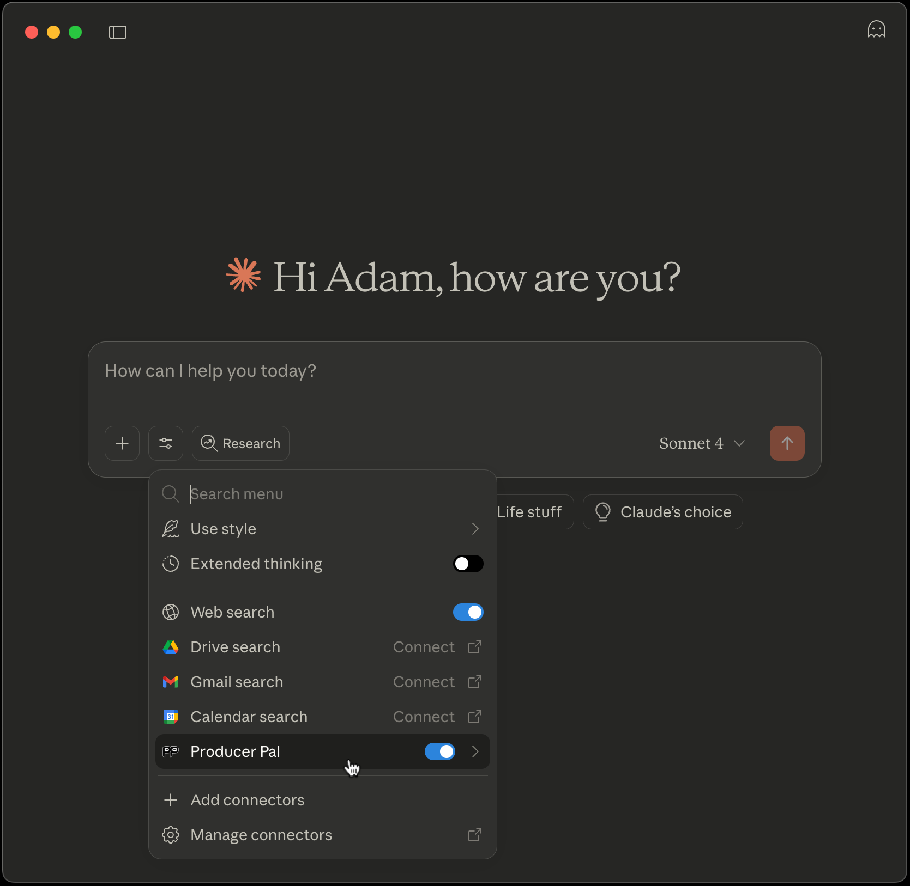

# <sub></sub> Producer Pal Installation Guide

1. Download the
   [Producer Pal Max for Live device (`Producer_Pal.amxd`)](https://github.com/adamjmurray/producer-pal/releases/latest/download/Producer_Pal.amxd).

2. Add `Producer_Pal.amxd` to a MIDI track in
   [Ableton Live 12.2+](https://www.ableton.com/live/) with
   [Max for Live](https://www.ableton.com/live/max-for-live/) (e.g. Ableton Live
   Suite):

   

   It should show "Producer Pal Running".

3. Setup an AI model to use Producer Pal:
   - [Anthropic Claude](#anthropic-claude-installation)
     - [Claude Desktop](#claude-desktop)
     - [Claude Code](#claude-code)
     - [claude.ai Web App](#claudeai-web-app)
   - [Google Gemini](#google-gemini)
     - [Gemini CLI](#gemini-cli)
   - [OpenAI](#openai)
     - [Codex CLI](#codex-cli)
     - [ChatGPT web app](#chatgpt-web-app)
   - [LM Studio](#lm-studio) for local models useable with no Internet,
     including:
     - Mistral AI Magistral
     - Alibaba Qwen 3
     - OpenAI GPT OSS
   - [Other MCP-compatible LLMs](#other-mcp-compatible-llms)

4. Start a conversation with "connect to ableton"

If it doesn't work, see the [troubleshooting guide](#troubleshooting).

## Choosing a Connection Method

Depending on the AI model you want to use, you may have choices between the
following connection methods:

### MCP Bundle

MCP bundles are plugins for desktop apps in the
[.mcbp format](https://github.com/anthropics/mcpb). It can be setup quickly in a
few clicks with no special technical knowledge required.

The `Producer_Pal.mcpb` file
[(download latest version here)](https://github.com/adamjmurray/producer-pal/releases/latest/download/Producer_Pal.mcpb)
is used to [install the Producer Pal Claude Desktop extension](#claude-desktop).
Currently it is only compatible with Claude Desktop. If you
[use Claude](#anthropic-claude-installation) this is the easiest way to start
using Producer Pal.

### producer-pal-portal.js

The `producer-pal-portal.js` script
[(download latest version here)](https://github.com/adamjmurray/producer-pal/releases/latest/download/producer-pal-portal.js)
can connect most local MCP-compatible AI apps to Producer Pal.

The script provides an
[MCP stdio transport](https://modelcontextprotocol.io/specification/2025-06-18/basic/transports#stdio)
connection to the Producer Pal
[MCP server](https://modelcontextprotocol.io/docs/learn/server-concepts) running
inside its Max for Live device.

This is recommended over the HTTP connection because it is more robust: it works
even if Ableton Live / Producer Pal is not running and will help you debug
broken connections. Note: this option requires [Node.js](https://nodejs.org/) to
be installed.

### HTTP

This is the most minimal install method. You only need the Producer Pal Max for
Live device and an MCP/HTTP-compatible AI app.

HTTP is the fastest way to try [Gemini CLI](#gemini-cli) and
[Claude Code](#claude-code) with Producer Pal.

HTTP is the only option for connecting remote clients like the
[claude.ai Web App](#claudeai-web-app) and [ChatGPT web app](#chatgpt-web-app),
but this also requires a [web tunnel](#web-tunneling-options). Note: You can
access Producer Pal from another computer on your local network without using a
web tunnel.

A downside compared to the `producer-pal-portal.js` script is you may need to
restart your AI app or refresh MCP servers if you forgot to run Ableton Live
with the Producer Pal Max for Live device first.

## Anthropic Claude Installation

No subscription is required to use Claude, but you must register an Anthropic
account and
[verify the account with a phone number](https://support.anthropic.com/en/articles/8287232-why-do-i-need-to-verify-my-phone-number).

### Claude Desktop

Claude Desktop is the easiest way to use Producer Pal with Claude.

1. Install [Claude Desktop](https://claude.ai/download)

2. Download the
   [Producer Pal Claude Desktop Extension (`Producer_Pal.mcpb`)](https://github.com/adamjmurray/producer-pal/releases/latest/download/Producer_Pal.mcpb)

3. Go to Claude Desktop &rarr; Settings &rarr; Extensions and:

   3a. If you already have extensions installed, drag and drop
   `Producer_Pal.mcp` into the Extensions screen:

   

   3b. Or, if you have never installed a Claude Desktop extension before, you
   need to click "Advanced settings" on the Extensions screen, then click
   "Install extension...", and choose the
   [Producer_Pal.mcpb](https://github.com/adamjmurray/producer-pal/releases/latest/download/Producer_Pal.mcpb)
   file.

    

4. Don't forget to click "Install" and complete the Claude Desktop installation:

   

5. You should see 20 Producer Pal tools in Claude's "Search and Tools" menu:

   

6. Start a conversation with "connect to ableton"

   

7. In order for Producer Pal to work, you need to allow the tools to be used:

   

### Claude Code

[Claude Code](https://claude.com/product/claude-code) is a command line
interface for Claude.

1. Install Claude Code: `npm install -g @anthropic/claude-code` (see
   [the official docs](https://www.anthropic.com/claude-code))
2. Download `producer-pal-portal.js` from the release and note its full path
3. Configure the MCP server via one of these
   [connection methods](#choosing-a-connection-method):
   - with producer-pal-portal.js
     ```bash
     claude mcp add producer-pal -- node /absolute/path/to/producer-pal-portal.js
     ```
   - or via HTTP
     ```bash
     claude mcp add --transport http producer-pal http://localhost:3350/mcp
     ```
4. Start Claude Code: `claude` (consider running in an empty directory)
5. Start a conversation with "connect to ableton"

### claude.ai Web App

To use Producer Pal through [the Claude web interface](https://claude.ai/new):

1. Set up [a web tunnel](#web-tunneling-options) to expose your local Producer
   Pal server, for example:

   ```bash
   ngrok http http://localhost:3350
   ```

   This gives you a public URL like `https://1234abcd.ngrok-free.app`

2. Go to [claude.ai settings](https://claude.ai/settings/connectors)
3. Add a Custom Connector with your tunnel URL + `/mcp`:
   ```
   https://1234abcd.ngrok-free.app/mcp
   ```
4. Start a conversation with "connect to ableton"

## Google Gemini

### Gemini CLI

[Gemini CLI](https://developers.google.com/gemini-code-assist/docs/gemini-cli)
is a command line interface for Google Gemini.

1. [Install Gemini CLI](https://github.com/google-gemini/gemini-cli?#-installation)
2. Configure MCP in `~/.gemini/settings.json` to use one of these
   [connection methods](#choosing-a-connection-method):

   **Option A: Via producer-pal-portal.js**

   ```json
   {
     "mcpServers": {
       // ... other MCP server configs ...
       "producer-pal": {
         "command": "node",
         "args": ["/absolute/path/to/producer-pal-portal.js"]
       }
     }
   }
   ```

   **Option B: Direct HTTP connection**

   ```json
   {
     "mcpServers": {
       // ... other MCP server configs ...
       "producer-pal": {
         "httpUrl": "http://localhost:3350"
       }
     }
   }
   ```

3. Run `gemini` to start the Gemini CLI
4. Start a conversation with "connect to ableton"

## OpenAI

### Codex CLI

[Codex CLI](https://developers.openai.com/codex/cli) is a command line interface
for OpenAI models.

1. [Install OpenAI Codex](https://github.com/openai/codex#quickstart)
2. Edit `~/.codex/config.toml` to setup one of these
   [connection methods](#choosing-a-connection-method):
   ```toml
   [mcp_servers.producer-pal]
   command = "node"
   args = ["/absolute/path/to/producer-pal-portal.js"]
   ```
3. Run `codex` (consider in an empty directory)
4. Start a conversation with "connect to ableton"

### ChatGPT Web App

To use Producer Pal through [the ChatGPT web interface](https://chatgpt.com/):

1. Set up [a web tunnel](#web-tunneling-options) to expose your local Producer
   Pal server, for example:

   ```bash
   ngrok http http://localhost:3350
   ```

   Note your public URL (e.g., `https://1234abcd.ngrok-free.app`)

2. Go to [ChatGPT](https://chatgpt.com) → Settings
3. Enable Developer Mode
4. Add a Custom Connector:
   - URL: Your tunnel URL + `/mcp` (e.g., `https://1234abcd.ngrok-free.app/mcp`)
   - No authentication required
   - Trust the connector

5. IMPORTANT: Start a new chat with Developer Mode and Producer Pal explicitly
   enabled
6. Start a conversation with "connect to ableton"

## LM Studio

Run AI models locally without Internet connection.

1. Download [LM Studio](https://lmstudio.ai/)
2. Install a compatible model:
   - Qwen 3+ (tested with the 4b-2507 and 4b-thinking-2507 models)
   - OpenAI GPT-OSS (tested with the 20B model)
   - Mistral AI Magistral (tested with the small-2509 model)
3. Configure MCP servers in LM Studio Settings → Program → Integrations → edit
   mcp.json using one of these
   [connection methods](#choosing-a-connection-method):

   **Option A: Via producer-pal-portal.js**

   ```json
   {
     "mcpServers": {
       // ... other MCP server configs ...
       "producer-pal": {
         "command": "node",
         "args": ["/absolute/path/to/producer-pal-portal.js"]
       }
     }
   }
   ```

   **Option B: Direct HTTP connection**

   ```json
   {
     "mcpServers": {
       // ... other MCP server configs ...
       "producer-pal": {
         "url": "http://localhost:3350/mcp"
       }
     }
   }
   ```

4. Start a conversation with "connect to ableton"

## Other MCP-compatible LLMs

Producer Pal works with any LLM that supports the Model Context Protocol.

You can use the
[STDIO or HTTP connection method](#choosing-a-connection-method).

### Local MCP via stdio

Configure your LLM to run:

```bash
node /path/to/producer-pal-portal.js
```

### Local MCP via HTTP

Connect directly to:

```
http://localhost:3350
```

### Remote MCP via HTTP tunnel

For cloud-hosted LLMs or remote access:

1. Set up a tunnel (e.g., ngrok, Pinggy)
2. Configure your LLM with the public URL + `/mcp`

## Web Tunneling Options

For remote access to Producer Pal, you'll need a tunneling service.

### ngrok (Recommended)

- [Sign up](https://ngrok.com) for persistent URLs (paid) or use free tier with
  changing URLs
- Install: `brew install ngrok` (macOS) or download from website
- Run: `ngrok http http://localhost:3350`

### Pinggy

- No installation required on macOS
- Run: `ssh -R 80:localhost:3350 a.pinggy.io`
- Free tier limited to 60 minutes

## Troubleshooting

### AI won't use Producer Pal

Some AIs won't respond properly to "connect to ableton" and may claim they can't
directly interact with Ableton Live even if they actually can. It's possible
everything is setup correctly and the AI needs a nudge to start using Producer
Pal. Try this first:

- Ask "what tools do you have?" and check if it can see Producer Pal tools such
  as `ppal-init`
- Say "call your ppal-init tool"

If you can successfully initiate a ppal-init tool call, Producer Pal should
work.

### Connection Issues

- Ensure Producer Pal device is loaded and running in Ableton Live
- Check that port 3350 is not blocked by firewall
- For remote connections, verify your tunnel is active

### MCP Server Not Found

- Verify the full path to `producer-pal-portal.js` is correct
- Ensure Node.js is installed and accessible from your terminal

### Tools Not Appearing

- Toggle the Producer Pal device off and on in Live
- Restart your AI interface
- Check the Max console for error messages

## Support

For issues and questions:

- Ask a question in
  [the questions forum](https://github.com/adamjmurray/producer-pal/discussions/categories/questions)
- Report bugs in
  [the bug reports forum](https://github.com/adamjmurray/producer-pal/discussions/categories/bug-reports)
  or [issues list](https://github.com/adamjmurray/producer-pal/issues)
- Documentation: See [the README](./README.md) and
  [developer documentation](./DEVELOPERS.md).
