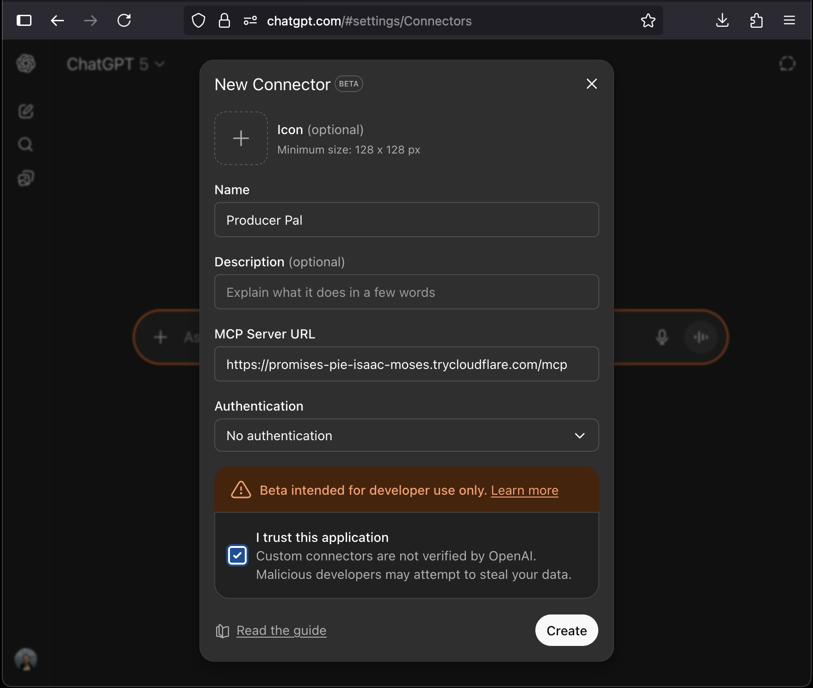

# <sub></sub> Producer Pal Installation Guide

Choose your AI for installation steps:

- ⭐️ [Claude Desktop](#claude-desktop) - Anthropic's desktop GUI
- ⭐️ [Producer Pal Chat UI](#producer-pal-chat-ui) - Built-in chat interface
  supporting Gemini, Mistral, offline models via Ollama, and more
- [Gemini CLI](#gemini-cli) - Google's command line agent
- [Codex CLI](#codex-cli) - OpenAI's command line agent
- [Claude Code](#claude-code) - Anthropic's command line agent
- [claude.ai Web App](#claudeai-web-app) - Anthropic's web app
- [ChatGPT Web App](#chatgpt-web-app) - OpenAI's web app
- [LM Studio](#lm-studio) - Run models completely offline
- [Other MCP-compatible LLMs](#other-mcp-compatible-llms)

_⭐️ indicates recommended options_

Already installed and it doesn't work? Try the
[Troubleshooting Guide](#troubleshooting).

## Upgrading

When installing a new version of Producer Pal:

1. **Download all new files:** Get the latest
   [`Producer_Pal.amxd`](https://github.com/adamjmurray/producer-pal/releases/latest/download/Producer_Pal.amxd)
   Max for Live device, and (if applicable) either
   [`Producer_Pal.mcpb`](https://github.com/adamjmurray/producer-pal/releases/latest/download/Producer_Pal.mcpb)
   (for Claude Desktop) or
   [`producer-pal-portal.js`](https://github.com/adamjmurray/producer-pal/releases/latest/download/producer-pal-portal.js)

2. **Replace the Max device:** Replace `Producer_Pal.amxd` in the location where
   you originally saved it (e.g. in your Live User Library). Live projects
   referencing this location will automatically use the new version.

   **Exception:** If you saved projects with "Collect All and Save" (with device
   files included), those have their own copy of Producer Pal. For those
   projects, drag the new `.amxd` into Live to replace the old version.

   Check the version number in the device UI to confirm you're running the
   latest version.

3. **For Claude Desktop users:**
   - Go to Settings → Extensions
   - Click the `...` menu on the old Producer Pal extension and select
     "Uninstall"
   - Install the new `Producer_Pal.mcpb` file (see
     [Claude Desktop installation](#claude-desktop))

4. **For other setups:** Replace the old `producer-pal-portal.js` with the new
   one at the same file path (so your configuration doesn't need updating)

5. **Restart your AI app** to ensure it picks up the changes

If you have issues after upgrading, see the
[Troubleshooting Guide](#troubleshooting).

<br>

## Claude Desktop

Anthropic's Claude Desktop app is the easiest, recommended way to use Producer
Pal.

### Requirements

- [Ableton Live 12.2+](https://www.ableton.com/live/) with
  [Max for Live](https://www.ableton.com/live/max-for-live/)
- [Claude Desktop](https://claude.ai/download) (requires Anthropic account)

### Installation

1. Download
   [Producer_Pal.amxd](https://github.com/adamjmurray/producer-pal/releases/latest/download/Producer_Pal.amxd),
   the Producer Pal Max for Live device, and add it to a MIDI track in Ableton
   Live:

   

   _It should display "Producer Pal Running" or something isn't working._

2. Download the
   [Producer Pal Claude Desktop Extension (`Producer_Pal.mcpb`)](https://github.com/adamjmurray/producer-pal/releases/latest/download/Producer_Pal.mcpb)

3. Go to Claude Desktop → Settings → Extensions and:

   3a. If you already have extensions installed, drag and drop
   `Producer_Pal.mcpb` into the Extensions screen:

   

   3b. Or, if you have never installed a Claude Desktop extension before, you
   need to click "Advanced settings" on the Extensions screen, then click
   "Install extension...", and choose the
   [Producer_Pal.mcpb](https://github.com/adamjmurray/producer-pal/releases/latest/download/Producer_Pal.mcpb)
   file.

    

4. Don't forget to click "Install" and complete the Claude Desktop installation:

   

   _**About the security warning:** Anthropic displays this warning for all
   extensions as a general security measure. Producer Pal is open source and you
   can review the entire codebase on
   [GitHub](https://github.com/adamjmurray/producer-pal) before installing. The
   extension only accesses Ableton Live through the Max for Live device._

5. You should see Producer Pal tools in Claude's "Search and Tools" menu (make
   sure it's enabled when starting a conversation):

   

6. Start a conversation with "connect to ableton"

7. Allow Producer Pal tools to be used when Claude tries to use them:

   

   

If it doesn't work, see the [Troubleshooting Guide](#troubleshooting).

<br><br>

## Producer Pal Chat UI

Producer Pal includes its own standalone web interface, independent from Claude
Desktop, Gemini CLI, or any other AI platform. The chat UI is served from the
Max for Live device and opens in your system's default browser.

The chat UI supports multiple LLM providers including Google Gemini (free tier
available), OpenAI, Mistral, OpenRouter, and custom OpenAI-compatible providers.

Note: Some options use pay-as-you-go pricing for API access, which can incur
cost quickly when using the most advanced models and having long conversations.
Always monitor your API key usage when using pay-as-you-go options.

### Requirements

- [Ableton Live 12.2+](https://www.ableton.com/live/) with
  [Max for Live](https://www.ableton.com/live/max-for-live/)
- Any LLM API that supports tools and has an OpenAI-compatible interface, or
  Google's Gemini API.

  This can be either:
  - Online LLM APIs. Supported APIs include:
    - ⭐️ [Google Gemini API](https://ai.google.dev/gemini-api) (recommended):
      All Google accounts can use the free tier with generous daily quotas.
      [Get a Gemini API key](https://aistudio.google.com/apikey).
    - [OpenAI API](https://openai.com/api/): Requires pay-as-you-go pricing.
      [Get an OpenAI API key](https://platform.openai.com/api-keys).
    - [Mistral](https://mistral.ai/): AI developed in France. Can be used for
      free but with fairly aggressive quotas.
      [Get a Mistral API key](https://console.mistral.ai/home?workspace_dialog=apiKeys).
    - [OpenRouter](https://openrouter.ai): An "AI gateway" with hundreds of LLMs
      available in one place. Includes free and pay-as-you-go options.
      [Get an OpenRouter API key](https://openrouter.ai/settings/keys)
    - Custom: Any other compatible LLM. See
      [Using Custom Providers](#using-custom-providers).

  Or:
  - Offline LLMs running locally. Supported options:
    - [LM Studio](#lm-studio-with-the-producer-pal-chat-ui)
    - [Ollama](#ollama)

### Installation

1. Download
   [Producer_Pal.amxd](https://github.com/adamjmurray/producer-pal/releases/latest/download/Producer_Pal.amxd),
   the Producer Pal Max for Live device, and add it to a MIDI track in Ableton
   Live:

   

   _It should display "Producer Pal Running" or something isn't working._

2. Open the "Setup" tab in the device and click "Open Chat UI", which will open
   [http://localhost:3350/chat](http://localhost:3350/chat) (or whatever port
   Producer Pal is setup to use)

   

3. If it's your first time, choose a provider, enter an API key (if using an
   online LLM), and choose a model. See below for examples and more info about
   the various settings. Once you've configured your settings, click "Save".

4. Click the "Quick Connect" button to start a chat:

   

   Or type whatever you want into the text input.

The chat UI connects directly to your chosen LLM provider's API and uses
Producer Pal's MCP tools automatically.

If it doesn't work, see the [Troubleshooting Guide](#troubleshooting).

**Privacy Note for Online APIs:** Your API key is stored in the browser's local
storage for convenience. If that concerns you, use a private browser session,
delete the key from settings after use, or delete browser local storage.
Generally, you can delete and regenerate API keys at any time.

### Chat UI Model Settings

**Thinking**: Some models support extended reasoning where they "think through"
problems before responding. This increases response time and token usage but can
improve quality for complex tasks. Enable if your model supports it and you need
more sophisticated musical decisions. Some reasoning models, such as Gemini,
support showing their "thoughts".

**Randomness** (0.0-1.0): Controls response randomness. Lower values (0.0 - 0.5)
make the model more focused and deterministic. Higher values (0.5 - 1.0) make it
more creative but potentially less coherent. Default is 0.5. For music
composition, try higher values depending on how experimental you want the
results.

### Using Local Providers

#### LM Studio with the Producer Pal Chat UI

1.  Install [LM Studio](https://lmstudio.ai/) and download some models
2.  Go to the LM Studio developer tab
3.  Open Server Settings and Enable CORS. Producer Pal's chat UI runs in the
    browser and cannot directly connect to LM Studio without this option:

    

4.  Start LM Studio server. It should say: "Status: Running"
5.  Configure the Producer Pal Chat UI:
    - Provider: LM Studio (local)
    - Port: 1234 (This is the default. If you change it in LM Studio settings,
      change this setting to match)
    - Model: A model that supports tools, such as `qwen/qwen3-vl-8b`,
      `openai/gpt-oss-20b`, or `mistralai/magistral-small-2509`

      **Note:** If the model responds with garbled text like
      `<|tool_call_start|>...` or says it has no way of connecting to Ableton,
      the model likely doesn't support tools. Try a different model. Look for a
      hammer icon next to the model:

      

6.  Save the Chat UI settings and use the Quick Connect button to start a
    conversation.

See the [LM Studio install guide](#lm-studio) (the instructions on how to setup
using LM Studio's chat UI instead of Producer Pal's UI) for tips on choosing and
configuring models with LM Studio. It's recommended you enable the "Small Model
Mode" option in the Producer Pal Setup tab for better compatibility with local
models.

#### Ollama

1. Install [Ollama](https://ollama.com/)
2. If you haven't already, run Ollama, select some of the downloadable
   (non-cloud) models, and start a chat with them to download them.
3. With Ollama running, configure the Producer Pal Chat UI:
   - Provider: Ollama (local)
   - Port: 11434 (This is the default. You generally don't need to change this)
   - Model: A [model that supports tools](https://ollama.com/search?c=tools),
     such as `qwen3-vl:8b`, `qwen-3-coder`, or `gpt-oss:20b`
4. Save the Chat UI settings and use the Quick Connect button to start a
   conversation.

### Using Custom Providers

To use other OpenAI-compatible providers beyond the built-in options:

1. Open the chat UI settings
2. Select "Custom (OpenAI-compatible)" as the provider
3. Enter your API key
4. Set the Base URL for your provider
5. Enter the model name

#### Custom Provider Example: Groq

- Provider: Custom (OpenAI-compatible)
- Base URL: `https://api.groq.com/openai/v1`
- Model: `moonshotai/kimi-k2-instruct` (or other available models like
  `openai/gpt-oss-120b`, `qwen/qwen3-32b`)

<br><br>

## Gemini CLI

Use Producer Pal with Google's command line coding assistant. No subscription
needed.

### Requirements

- [Ableton Live 12.2+](https://www.ableton.com/live/) with
  [Max for Live](https://www.ableton.com/live/max-for-live/)
- [Node.js 20+](https://nodejs.org/en/download)
- [Gemini CLI](https://github.com/google-gemini/gemini-cli?#-installation)
  (requires Google account)

### Installation

1. Download
   [Producer_Pal.amxd](https://github.com/adamjmurray/producer-pal/releases/latest/download/Producer_Pal.amxd),
   the Producer Pal Max for Live device, and add it to a MIDI track in Ableton
   Live:

   

   _It should display "Producer Pal Running" or something isn't working._

2. Add Producer Pal to Gemini's settings in `~/.gemini/settings.json`:

   **Option A: With producer-pal-portal.js (recommended)**:

   Download
   [producer-pal-portal.js](https://github.com/adamjmurray/producer-pal/releases/latest/download/producer-pal-portal.js)
   and configure:

   ```json
   {
     "mcpServers": {
       // ... other MCP server configs ...
       "producer-pal": {
         "command": "node",
         "args": ["/absolute/path/to/producer-pal-portal.js"]
       }
     }
   }
   ```

   **Option B: Direct HTTP**

   ```json
   {
     "mcpServers": {
       // ... other MCP server configs ...
       "producer-pal": {
         "httpUrl": "http://localhost:3350/mcp"
       }
     }
   }
   ```

   _When using direct HTTP, start Ableton Live with Producer Pal before Gemini
   CLI._

3. Run `gemini` to start the Gemini CLI in an empty folder (so it can focus on
   Producer Pal instead of coding)

4. Run `/mcp list` in the Gemini CLI to confirm the Producer Pal tools are
   available:

   

5. Start a conversation with "connect to ableton"

6. Allow Producer Pal tools to be used when Gemini tries to use them:

   

   

If it doesn't work, see the [Troubleshooting Guide](#troubleshooting).

<br><br>

## Codex CLI

Use Producer Pal with OpenAI's command line coding assistant.

### Requirements

- [Ableton Live 12.2+](https://www.ableton.com/live/) with
  [Max for Live](https://www.ableton.com/live/max-for-live/)
- [Node.js 22+](https://nodejs.org/en/download)
- [OpenAI Codex](https://github.com/openai/codex#quickstart) (requires OpenAI
  account, and a paid subscription at time of writing)

### Installation

1. Download
   [Producer_Pal.amxd](https://github.com/adamjmurray/producer-pal/releases/latest/download/Producer_Pal.amxd),
   the Producer Pal Max for Live device, and add it to a MIDI track in Ableton
   Live:

   

   _It should display "Producer Pal Running" or something isn't working._

2. Add Producer Pal to Codex's settings in `~/.codex/config.toml`:

   **Option A: With producer-pal-portal.js (recommended)**:

   Download
   [producer-pal-portal.js](https://github.com/adamjmurray/producer-pal/releases/latest/download/producer-pal-portal.js)
   and configure:

   ```toml
   [mcp_servers.producer-pal]
   command = "node"
   args = ["/absolute/path/to/producer-pal-portal.js"]
   ```

   **Option B: Direct HTTP**

   ```toml
   [mcp_servers.producer-pal]
   url = "http://localhost:3350/mcp"
   ```

   _When using direct HTTP, start Ableton Live with Producer Pal before Codex
   CLI._

3. Run `codex` in an empty folder (so it can focus on Producer Pal instead of
   coding)

4. Run `/mcp` in the Codex CLI to confirm the Producer Pal tools are available:

   

5. Start a conversation with "connect to ableton"

   

If it doesn't work, see the [Troubleshooting Guide](#troubleshooting).

<br><br>

## Claude Code

Use Producer Pal with Anthropic's command line coding assistant.

### Requirements

- [Ableton Live 12.2+](https://www.ableton.com/live/) with
  [Max for Live](https://www.ableton.com/live/max-for-live/)
- [Node.js 20+](https://nodejs.org/en/download)
- [Claude Code](https://www.anthropic.com/claude-code) (requires Anthropic
  account, and a paid subscription at time of writing)

### Installation

1. Download
   [Producer_Pal.amxd](https://github.com/adamjmurray/producer-pal/releases/latest/download/Producer_Pal.amxd),
   the Producer Pal Max for Live device, and add it to a MIDI track in Ableton
   Live:

   

   _It should display "Producer Pal Running" or something isn't working._

2. Configure Claude Code to use Producer Pal:

   **Option A: With producer-pal-portal.js (recommended)**:

   Download
   [producer-pal-portal.js](https://github.com/adamjmurray/producer-pal/releases/latest/download/producer-pal-portal.js)
   and run:

   ```bash
   claude mcp add producer-pal -- node /absolute/path/to/producer-pal-portal.js
   ```

   **Option B: Direct HTTP**

   ```bash
   claude mcp add --transport http producer-pal http://localhost:3350/mcp
   ```

   _When using direct HTTP, start Ableton Live with Producer Pal before Claude
   Code._

3. Start Claude Code by running `claude` in an empty folder (so it can focus on
   Producer Pal instead of coding)

4. Run `/mcp` in Claude Code to confirm the Producer Pal tools are available:

   

   

5. Start a conversation with "connect to ableton"

6. Allow Producer Pal tools to be used when Claude tries to use them:

   

   

If it doesn't work, see the [Troubleshooting Guide](#troubleshooting).

<br><br>

## claude.ai Web App

Use Producer Pal in your web browser with Anthropic's chat web app.

### Requirements

- [Ableton Live 12.2+](https://www.ableton.com/live/) with
  [Max for Live](https://www.ableton.com/live/max-for-live/)
- [Claude account](https://claude.ai)
- [Web tunnel](#web-tunnels) (e.g. Cloudflare or Pinggy)

### Installation

1. Download
   [Producer_Pal.amxd](https://github.com/adamjmurray/producer-pal/releases/latest/download/Producer_Pal.amxd),
   the Producer Pal Max for Live device, and add it to a MIDI track in Ableton
   Live:

   

   _It should display "Producer Pal Running" or something isn't working._

2. Set up [a web tunnel](#web-tunnels) to expose your local Producer Pal server.

   For example:

   ```bash
   cloudflared tunnel --url http://localhost:3350
   ```

   will give you a public URL such as `https://abc-xyz.trycloudflare.com`:

   

3. Go to
   [claude.ai settings → connectors](https://claude.ai/settings/connectors)
4. Add a custom connector with your tunnel URL + `/mcp`

   (e.g. `https://abc-xyz.trycloudflare.com/mcp`):

   

5. You should see Producer Pal tools in Claude's "Search and Tools" menu (make
   sure it's enabled when starting a conversation):

   

6. Start a conversation with "connect to ableton"

7. Allow Producer Pal tools to be used when Claude tries to use them:

   

   

If it doesn't work, see the [Troubleshooting Guide](#troubleshooting).

<br><br>

## ChatGPT Web App

Use Producer Pal in your web browser with OpenAI's chat web app.

### Requirements

- [Ableton Live 12.2+](https://www.ableton.com/live/) with
  [Max for Live](https://www.ableton.com/live/max-for-live/)
- [ChatGPT account](https://chatgpt.com) (at the time of writing, a paid
  subscription is required to access the advanced settings needed for this to
  work)
- [Web tunnel](#web-tunnels) (e.g. Cloudflare or Pinggy)

### Installation

1. Download
   [Producer_Pal.amxd](https://github.com/adamjmurray/producer-pal/releases/latest/download/Producer_Pal.amxd),
   the Producer Pal Max for Live device, and add it to a MIDI track in Ableton
   Live:

   

   _It should display "Producer Pal Running" or something isn't working._

2. Set up [a web tunnel](#web-tunnels) to expose your local Producer Pal server.

   For example:

   ```bash
   cloudflared tunnel --url http://localhost:3350
   ```

   will give you a public URL such as `https://abc-xyz.trycloudflare.com`:

   

3. Go to
   [ChatGPT → Settings → Apps & Connectors → Advanced](https://chatgpt.com/#settings/Connectors/Advanced)
   and enable Developer Mode (this option might not appear for free accounts):

   

4. In the [Apps & Connectors](https://chatgpt.com/#settings/Connectors)
   settings, create a custom connector:
   - URL: Your tunnel URL + `/mcp`

     (e.g., `https://abc-xyz.trycloudflare.com/mcp`)

   - No authentication
   - Trust the app

   

5. Explicitly enable the Producer Pal tools for each conversation where you want
   to use them:

   

6. Start a new chat "connect to ableton with your producer pal tools" (note that
   ChatGPT tends to need more nudging than "connect to ableton"):

   

If it doesn't work, see the [Troubleshooting Guide](#troubleshooting).

<br><br>

## LM Studio

Use Producer Pal completely offline without an Internet connection.

### Requirements

- [Ableton Live 12.2+](https://www.ableton.com/live/) with
  [Max for Live](https://www.ableton.com/live/max-for-live/)
- [LM Studio](https://lmstudio.ai/)

**⚠️ Experimental:** This requires a relatively new machine with decent specs
(Apple Silicon with lots of RAM or PCs with Nvidia 4080+ graphics cards). It
requires more technical know-how to setup and debug. The online options
documented above work significantly better and faster at the time of writing.
However, completely offline and private usage is compelling.

### Installation

1. Download
   [Producer_Pal.amxd](https://github.com/adamjmurray/producer-pal/releases/latest/download/Producer_Pal.amxd),
   the Producer Pal Max for Live device, and add it to a MIDI track in Ableton
   Live:

   

   _It should display "Producer Pal Running" or something isn't working._

2. Optional / Recommended: In Producer Pal's "Setup" tab, enable "Small Model
   Mode":

   

   _This option is disabled by default and must be enabled each time you add
   Producer Pal to Live._

3. Install a compatible model in LM Studio, such as:
   - Qwen 3+ (4b-2507, 4b-thinking-2507)
   - OpenAI GPT-OSS (20B)
   - Mistral AI Magistral (small-2509)
   - Granite 4+ (4.0-h-tiny)
4. Setup Producer Pal in LM Studio Settings → Program → Integrations → edit
   mcp.json:

   **Option A: With producer-pal-portal.js (recommended)**:

   Download
   [producer-pal-portal.js](https://github.com/adamjmurray/producer-pal/releases/latest/download/producer-pal-portal.js)
   and configure:

   ```json
   {
     "mcpServers": {
       // ... other MCP server configs ...
       "producer-pal": {
         "command": "node",
         "args": ["/absolute/path/to/producer-pal-portal.js"]
       }
     }
   }
   ```

   **Option B: Direct HTTP**

   ```json
   {
     "mcpServers": {
       // ... other MCP server configs ...
       "producer-pal": {
         "url": "http://localhost:3350/mcp"
       }
     }
   }
   ```

   _When using direct HTTP, start Ableton Live with the Producer Pal device
   before enabling the Producer Pal MCP server inside LM Studio._

5. Confirm the Producer Pal tools are listed under Settings → Program:

   

   _See below for tips on a subset of tools to use._

6. Start a conversation with Producer Pal MCP active and say "connect to
   ableton"

7. If you didn't enable "Allow all" under Settings → Program, then allow
   Producer Pal tools in the conversation:

   

   

If it doesn't work, see the [Troubleshooting Guide](#troubleshooting).

### Local Model Tips

- A **context length of about 8k (8000)** is needed to start a conversation with
  Producer Pal and send a few messages.
- A **context length of 16k (16000) or higher is recommended** for achieving
  useful results, but higher context lengths can make the model run
  significantly slower, especially as the conversation grows. Experiment to find
  the right balance.
- To help the model make good tool choices and get more out of the limited
  context length, disable some of the Producer Pal tools. To focus on MIDI clip
  generation, a good minimal toolset for experimentation is:
  - `ppal-connect`
  - `ppal-read-live-set`
  - `ppal-read-track`
  - `ppal-create-clip`
  - `ppal-delete`
  - `ppal-playback`

  Try disabling all the other tools and add back when you miss features.

- Experiment with empty or extremely simple Live projects
- Only work with very simple material (e.g. basic MIDI patterns in clips 4 bars
  or shorter)
- Note that small models are guided to delete and start over rather make edits
  (other than simple additions)
- If the AI struggles and makes mistakes, don't hesitate to delete recent
  messages from the chat, edit your last message, and try again. Don't waste
  tokens correcting the LLM. Back up and avoid the issue or try something else.
- Shut down every other app you don't need to be running
- Consider running Ableton Live on a different machine on the local network
- When using a model with the GGUF engine, try enabling the
  advanced/experimental settings for Flash Attention and setting the K/V caches'
  quantization to Q8 or Q4.
- Research how to optimize for your specific machine / GPU hardware

#### Advanced: Customizing Skills

Local models vary widely in capabilities. **First, try enabling "Small Model
Mode" in Producer Pal's Setup tab** (see LM Studio installation step 2 above) -
this uses a simplified instruction set designed for smaller models.

If Small Model Mode isn't working well for you, or you want to experiment
further, you can customize Producer Pal's behavior for your specific model:

1. Download this repository and follow the dev setup and build instructions in
   [DEVELOPERS.md](./DEVELOPERS.md)
2. Edit `src/skills/basic.js` - the skills file used by Small Model Mode (or
   edit `src/skills/standard.js` to adjust regular mode)
3. Experiment with instruction wording, remove features your model struggles
   with, or adjust the guidance
4. Rebuild with `npm run build`
5. Use the development version of `Producer_pal.amxd` in Ableton Live
6. Reload your Producer Pal MCP server in LM Studio and start a new conversation

**Share your findings:** If you discover configurations that work well for
specific models, please share in
[GitHub Discussions](https://github.com/adamjmurray/producer-pal/discussions).
The community benefits from learning what works with different local models.

<br><br>

## Other MCP-compatible LLMs

Producer Pal works with any LLM that supports the Model Context Protocol (MCP).

### Requirements

- [Ableton Live 12.2+](https://www.ableton.com/live/) with
  [Max for Live](https://www.ableton.com/live/max-for-live/)
- AI that supports [MCP](https://modelcontextprotocol.io)
- Potentially: [Node.js 20+](https://nodejs.org/en/download)

### Installation

Download
[Producer_Pal.amxd](https://github.com/adamjmurray/producer-pal/releases/latest/download/Producer_Pal.amxd),
the Producer Pal Max for Live device, and add it to a MIDI track in Ableton
Live:

   

_It should display "Producer Pal Running" or something isn't working._

Then, configure your AI to connect to Producer Pal using one of the following
methods.

#### Option A: Local MCP via stdio (recommended)

Download
[producer-pal-portal.js](https://github.com/adamjmurray/producer-pal/releases/latest/download/producer-pal-portal.js)
and configure your LLM MCP to use:

```bash
node /path/to/producer-pal-portal.js
```

This option requires [Node.js 20+](https://nodejs.org/en/download).

#### Option B: Local MCP via HTTP

Use the URL:

```
http://localhost:3350/mcp
```

Sometimes an additional setting is needed for HTTP connections. For example,
[Cline](https://cline.bot/) requires `"type": "streamableHttp"` to be configured
along with the `url` (see example below).

You may need to restart your AI app or refresh MCP servers if you forgot to run
Ableton Live with Producer Pal Max first.

#### Option C: Remote MCP via HTTP tunnel

For cloud-hosted LLMs or remote access:

1. Set up a [web tunnel](#web-tunnels) (e.g. Cloudflare or Pinggy)
2. Configure your LLM with the public URL + `/mcp`

#### Example: Configuring Cline

[Cline](https://cline.bot/) is an IDE plugin for AI that can be configured to
use Producer Pal in its `cline_mcp_settings.json` config file:

```json
{
  "mcpServers": {
    // ... other MCP server configs ...
    "producer-pal": {
      "command": "node",
      "args": ["/absolute/path/to/producer-pal-portal.js"]
    },
    // OR
    "producer-pal-http": {
      "type": "streamableHttp",
      "url": "http://localhost:3350/mcp"
    }
  }
}
```

Once Producer Pal is configured, start a new chat with Producer Pal tools
enabled, say "connect to ableton" or "connect to ableton with your producer pal
tools", and allow the tools to be used:


If it doesn't work, see the [Troubleshooting Guide](#troubleshooting).

<br><br>

## Web Tunnels

For remote access to Producer Pal from the Internet, you'll need a tunneling
service.

**⚠️ Security:** Producer Pal has no authentication. Anyone with your tunnel URL
can control Ableton Live. Keep the URL secret and only share with trusted
collaborators. If someone discovers it, restart your tunnel to get a new URL.

**For local networks** (studios, classrooms, performances): You don't need a
tunnel. Customize the port number in the Producer Pal device settings
(default: 3350) to prevent unauthorized access from other devices on the same
network. Update the `:3350` in your AI connection settings if you change it in
the Producer Pal Max for Live device.

### Cloudflare Quick Tunnels (Recommended)

- No account needed to get started
- Randomized domains so you can restart if one leaks (see security warning
  above)
- Install: `brew install cloudflared` (macOS) or
  [check the website for install instructions](https://developers.cloudflare.com/cloudflare-one/connections/connect-networks/do-more-with-tunnels/trycloudflare/)
- Run: `cloudflared tunnel --url http://localhost:3350`

### Pinggy

- No installation required on macOS
- Run: `ssh -R 80:localhost:3350 a.pinggy.io`
- Free tier limited to 60 minutes,
  [check the website for more info](https://pinggy.io/)

### ngrok

- ⚠️ Gives a single persistent domain to all free accounts on sign-up, which, if
  leaked, can't be changed
- Install: `brew install ngrok` (macOS) or
  [check the website for install instructions](https://ngrok.com)
- Run: `ngrok http http://localhost:3350`

<br><br>

## Troubleshooting

### AI won't use Producer Pal

Verify your setup:

- Producer Pal Max for Live device is running in Ableton Live and displays
  "Producer Pal Running"
- Producer Pal tools are enabled in your AI app (most apps let you view
  available MCP tools/extensions)
- If either was missing, start a new conversation. If that doesn't work, restart
  your AI app completely.

If the AI claims it can't interact with Ableton Live:

1. Ask "what tools do you have?"
2. Verify it lists Producer Pal tools like `ppal-connect`
3. Say "call your ppal-connect tool"

Once ppal-connect is called, Producer Pal should work. If "connect to ableton"
doesn't trigger it, try:

- "connect to ableton with your tools"
- "connect to ableton with your ppal-connect tool"

If tools are visible but the AI won't call them, check you're using a model that
supports tool calling. Many local models (including some in LM Studio) don't
support tools.

### Connection Issues

- Ensure Producer Pal device is loaded and running in Ableton Live
- Check that port 3350 is not blocked by firewall
- For remote connections, verify your tunnel is active

### MCP Server Not Found

- Verify the full path to `producer-pal-portal.js` is correct
- Ensure Node.js is installed and accessible from your terminal

### Tools Not Appearing

- Toggle the Producer Pal device off and on in Live
- Restart your AI interface
- Check the Max console for error messages

### After Upgrading

If Producer Pal stops working after installing a new version:

- **Claude Desktop users:** Make sure you uninstalled the old extension before
  installing the new one
- **All users:** Verify you replaced both the `.amxd` device AND the portal/mcpb
  files (if applicable for your installation)
- Try deleting and re-adding the Producer Pal device in Ableton Live
- Restart your AI app completely
- Start a fresh conversation

### Getting Support

- Ask in
  [the discussion forum](https://github.com/adamjmurray/producer-pal/discussions/categories/questions)
- Report bugs in
  [the bug reports forum](https://github.com/adamjmurray/producer-pal/discussions/categories/bug-reports)
  or [issues list](https://github.com/adamjmurray/producer-pal/issues)
- Documentation: See [the README](./README.md) and
  [developer documentation](./DEVELOPERS.md).
