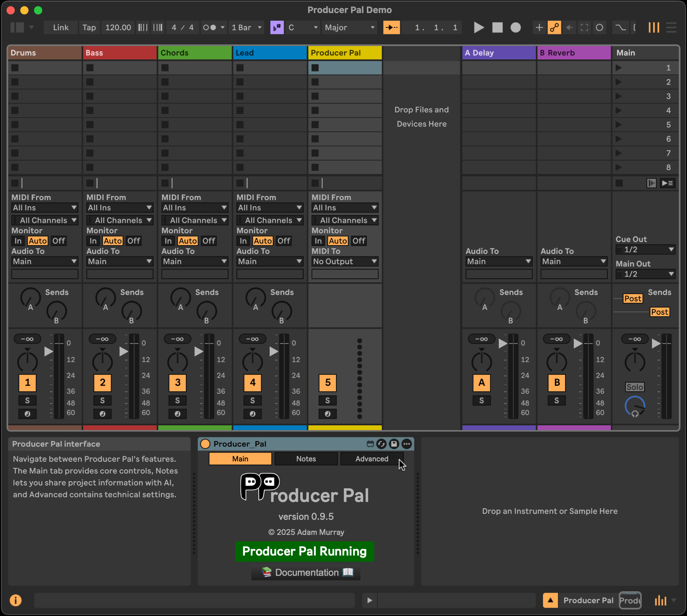

#  Producer Pal

Collaboratively make music in Ableton Live with an AI assistant.

Works with any LLM that supports
[MCP tools](https://modelcontextprotocol.io/docs/learn/server-concepts#tools)
including:

- [Anthropic Claude](https://claude.com/product/overview)
- [Google Gemini](https://gemini.google/overview)
- [OpenAI GPT](https://chatgpt.com/overview)
- Offline local LLMs via apps like [LM Studio](https://lmstudio.ai/), such as:
  - [Qwen 3 (4B)](https://qwenlm.github.io/blog/qwen3/)
  - [GPT OSS (20B)](https://openai.com/index/introducing-gpt-oss/)
  - [Mistral Magistral (small)](https://mistral.ai/news/magistral)

See the [Producer Pal Installation Guide](./INSTALLATION.md) to get started with
any of these AI models, or continue reading for a
[Quick Start Guide for Claude Desktop](#installation).

Find out what's new in
[the latest release notes](https://github.com/adamjmurray/producer-pal/releases/latest/).

## Demo

Watch
[how to install and use Producer Pal with Claude Desktop](https://www.youtube.com/watch?v=ypZBVI0Ncso)
(_3⅓ minutes long, no sound for the first 90 seconds_), or click the thumbnail
to jump to the music-making:

<a href="https://www.youtube.com/watch?v=ypZBVI0Ncso&t=86s">
<figure>
    
   
  <figcaption>Watch Producer Pal create a 4-part, 8-bar loop from scratch.</figcaption>
   
</figure>
</a>

## Requirements

- [Ableton Live 12.2+](https://www.ableton.com/live/) with
  [Max for Live](https://www.ableton.com/live/max-for-live/) (e.g. Ableton Live
  Suite edition)
- A compatible AI app (see the [Installation Guide](./INSTALLATION.md) or
  continue reading to [setup with Claude Desktop](#installation))

## Installation

1. Download
   [the `Producer_Pal.amxd` Max for Live device](https://github.com/adamjmurray/producer-pal/releases/latest/download/Producer_Pal.amxd)

2. Add `Producer_Pal.amxd` to an Ableton Live project

   

3. Setup an AI model to use Producer Pal:

   3a. Continue reading for the
   [Quick Start for Claude Desktop](#quick-start-for-claude-desktop)

   3b. Or see the [Installation Guide](./INSTALLATION.md) to use other
   apps/LLMs, including [Gemini CLI](./INSTALLATION.md#gemini-cli) or
   [OpenAI Codex CLI](./INSTALLATION.md#codex-cli)

### Quick Start for Claude Desktop

If you are using [Claude Desktop](https://claude.ai/download):

4.  Download
    [the `Producer_Pal.mcpb` Claude Desktop extension](https://github.com/adamjmurray/producer-pal/releases/latest/download/Producer_Pal.mcpb)

5.  Install it into Claude Desktop by going to Claude Desktop &rarr; Settings
    &rarr; Extensions and:

    5a. If you already have extensions installed, you can drag and drop
    `Producer_Pal.mcpb` into the Extensions screen:

     

    5b. Or, if you have never installed a Claude Desktop extension before, you
    need to click "Advanced settings" on the Extensions screen, then click
    "Install extension...", and choose the `Producer_Pal.mcpb` file.

    

6.  Don't forget to click "Install" and complete the Claude Desktop
    installation:

    

7.  You should see Producer Pal tools in Claude's "Search and Tools" menu (make
    sure it's enabled when starting a conversation):

    

8.  Start a conversation with "connect to ableton"

    

9.  In order for Producer Pal to work, you need to allow the tools to be used:

    

See the [Usage Guide](#usage) for more help getting started.

## Support and Issues

- **Bug Reports**:
  [GitHub Issues](https://github.com/adamjmurray/producer-pal/issues) (please do
  not send pull requests)
- **Documentation**:
  [GitHub Homepage (this page)](https://github.com/adamjmurray/producer-pal/#readme)
  and [the dedicated area of my website](https://adammurray.link/producer-pal/)
- **Community**:
  [GitHub Discussions](https://github.com/adamjmurray/producer-pal/discussions)

## ⚠️ Important Notices

**🧪 EXPERIMENTAL SOFTWARE**: Always save and backup your Live sets before use.
The software may cause crashes, data loss, or unexpected behavior.

**🔒 PRIVACY**: When using an online model from Anthropic, Google, OpenAI, etc
your musical data (MIDI notes, track names, tempo, etc.) is transmitted to the
online service for processing. Review the AI provider's privacy policy and
account settings for more info. Do not use online AI services with confidential
or commercially sensitive musical content. Producer Pal supports offline models
for scenarios where data must be kept private.

**💰 USAGE COSTS**: Producer Pal itself is free. Some AI models require
subscriptions, or API keys that can cost money for every interaction. Many AI
models supported by Producer Pal have a free tier with usage limits.

## Usage

### Basic Examples

- Start a chat like:

  > connect to ableton

- If Ableton Live or the Producer Pal Max for Live device aren't running, the AI
  will let you know. Once it's running, say:

  > try again

- Setup a drum rack in a track called "Drums" and ask:

  > find the drums track and generate a 4-bar drum loop

  then:

  > I like that, make some variations

  or:

  > great! can you expand that to 16 bars?

  or:

  > it's pretty repetitive, can you add some drum fills on the last few beats?

  or:

  > meh, that's not very good. do something more like ...

  the better you can describe exactly what you want, the better the results
  should be.

- Setup some pads or keys in a track called "Chords" and ask:

  > in the chords track, generate a 4-chord progression of whole notes in C
  > minor

- Then (with a "Bass" track):

  > in the bass track, generate a bassline to go along with that chord
  > progression

- Let the AI tell you what else it can do:

  > what are all the things you can do with your Ableton Live tools?

### Session and Arrangement views

Producer Pal understands how to use both the Session view and the Arrangement
view of Ableton Live. Use Session view for idea generation and jamming, and if
you like the results, you can ask Producer Pal to help lay it out as a song in
Arrangement view. Or open existing Session-based projects and get help turning
them into full songs. Feel free to jump directly to Arrangement view if that's
your preference for new projects.

### Limitations

Producer Pal is focused on generating and manipulating MIDI clips.

It cannot (yet) manage devices (instruments or effects) in your tracks. You must
add and adjust all devices yourself. Note that it can duplicate tracks,
including all the track's devices.

It cannot work with audio clips beyond some general features like deleting and
duplicating clips (it cannot add new audio clips or create audio from scratch).

Although Drum Racks are supported in arbitrary instrument rack structures
(nested at any depth, in any chain position), tracks with multiple Drum Racks
have a limitation: only the first Drum Rack found during device traversal will
populate the drum map (which tells the AI which pitches correspond to which drum
sounds). Subsequent Drum Racks on the same track are ignored. To ensure
predictable drum programming, avoid using multiple Drum Racks within a single
track when working with Producer Pal.

### Advanced Examples

Above are some basic ideas to get you started. For best results, be very
specific and detailed about what you want. Instead of "generate a melody", try:

> Generate an 8-bar EDM-style synthesizer melody in the key of C major with a
> mix of whole notes, half notes, quarter notes, and eighth notes. Use some
> dotted rhythms and syncopation too. Keep the center of the melody around the C
> above middle C.

If you don't know enough about music theory to ask for things like this, try
asking the AI for help learning music theory. Or just describe it the best you
can and chat back and forth as needed to clarify. Find your own way to interact
with it based on your unique perspective. For example, if you aren't sure how to
ask for specific aspects of a melody, you could ask things like "What makes a
good melody in [some genre]?", chat about that topic, and then ask "Show me an
example of a melody like that in the lead track in Ableton Live". It can be very
powerful to ask the AI to perform web searches and do research during these
types of conversations.

### Advanced Technique: MIDI Layering with routeToSource

Producer Pal can create sophisticated layering setups where multiple tracks
control a single instrument:

**Example: Create a phasing pattern**

> Duplicate the melody track and use routeToSource. Then make the clips
> different lengths - a 3-bar pattern on one track and a 4-bar pattern on the
> other creates an evolving 12-bar cycle.

**Example: Build complex drums from simple parts**

> Create a basic kick pattern, then duplicate the track with routeToSource. Add
> hi-hats to the new track. Duplicate again for snares. Now you can launch
> different combinations of clips for dynamic drum arrangements.

**Example: Polyrhythmic textures**

> After creating a 4/4 arpeggio, duplicate with routeToSource and change the new
> clip to 7/8 time. The polyrhythmic interplay creates rich, evolving textures.

## Tips

For a full feature reference see [FEATURES.md](./FEATURES.md).

**Always keep backups and save often!** Don't let AI loose on a serious song you
care about unless you've saved a backup copy. Producer Pal can overwrite and
delete things. If you make good progress, save it before you lose it.

Producer Pal can't read your mind, so if it doesn't do what you wanted, try to
clearly tell it what it did wrong and what you wanted instead. Assuming it has
the functionality, it can often correct itself with clear feedback. If it
doesn't have the functionality, it should be able to explain its limitations and
help set your expectations.

If the AI is making mistakes or you are asking for something particularly
complex, if the AI supports it (e.g. Claude), try the "extended thinking"
feature or set thinking/reasoning effort to high. Note this is probably overkill
most of the time and will reach usage limits faster, so it's recommended to
leave it off until you need it.

Keep your context window small for best results. In practical terms, that means:
If you have a very long conversation, consider starting a new conversation. The
AI can easily re-read the state of Ableton Live in a new conversation (just say
"connect to ableton" again). If you want to maintain context from the old
conversation, ask the AI to summarize the current conversation and copy and
paste that summary into a new conversation. Or add things you want the AI to
remember to the project notes in the Max for Live device's UI.

To help keep your context window small, it's recommended to use standalone
conversations by default and not use a "project" with additional context (e.g. a
Claude Project). In the context of coding assistants like Gemini CLI, Codex CLI,
and Claude Code, this means running the AI in an empty folder (not a code
repository) when you want to use Produce Pal. However, you may find value in
setting up a focused AI project for specific musical goals, for example, by
specifying music theory rules and info in a Claude Project's instructions and/or
knowledge base files.

## Producer Pal's Mission

- Supplement, complement, enhance, and amplify human creativity. Don't replace
  human creativity!

- Help people get unblocked when they're creatively blocked.

- Make it easier to experiment with music in terms of high level ideas instead
  of the low level piano roll events.

- Facilitate life-long learning by teaching people things they didn't know about
  music theory, composition, and arrangement.

- Help people with disabilities produce music (assuming Claude Desktop or an
  alternative chat client can be used in a hands-free voice mode, this should be
  possible)
