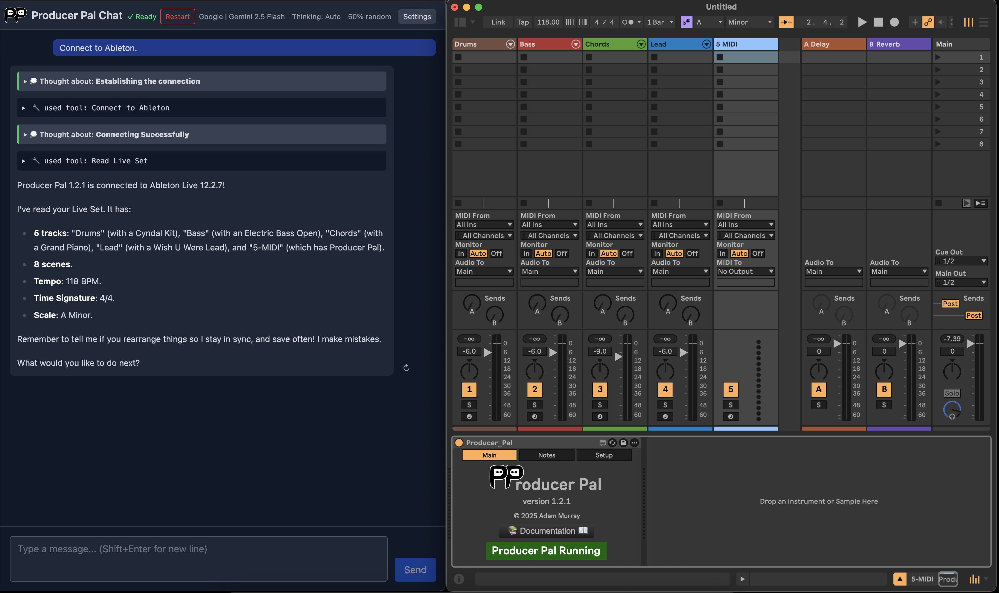

<h1 align="center"><a href="https://producer-pal.org"> Producer Pal</a></h1>

**Control Ableton Live with words**

AI-powered assistant for music production. Works with Claude, Gemini, ChatGPT,
Ollama, and more.

Official website: <a href="https://producer-pal.org">producer-pal.org</a>

## Quick Start

1. **Install**: Download
   [Producer_Pal.amxd](https://github.com/adamjmurray/producer-pal/releases/latest/download/Producer_Pal.amxd)
2. **Setup**: Follow the
   [installation guide](https://producer-pal.org/installation) for your AI
3. **Create**: Say "connect to ableton" and start making music

**→ [Full Documentation](https://producer-pal.org)**

## Demo

[Watch the walkthrough video](https://www.youtube.com/watch?v=IB19LqTZQDU&list=PLFqWfbwGKmqenUb1DUFZ5ECYU6klUWNtX&t=202s).

## Resources

- [Documentation](https://producer-pal.org)
- [Video Tutorials](https://www.youtube.com/playlist?list=PLFqWfbwGKmqenUb1DUFZ5ECYU6klUWNtX)
- [Latest Releases](https://github.com/adamjmurray/producer-pal/releases)
- [Discussions](https://github.com/adamjmurray/producer-pal/discussions)
- [Issues](https://github.com/adamjmurray/producer-pal/issues)

## Contributing

Star ⭐️ the repo to help others discover Producer Pal!

Want to contribute or build from source? See [DEVELOPERS.md](./DEVELOPERS.md).

## Open Source

Producer Pal is open source software licensed under the
[GNU Affero General Public License (AGPL-3.0)](./LICENSE). This means:

- Free to use (no subscriptions, paywalls, or “premium” features)
- Source code is public and development happens on GitHub
- Forks and modifications are allowed under AGPL
- If you host a modified version (including SaaS), you must provide the source
  to users
