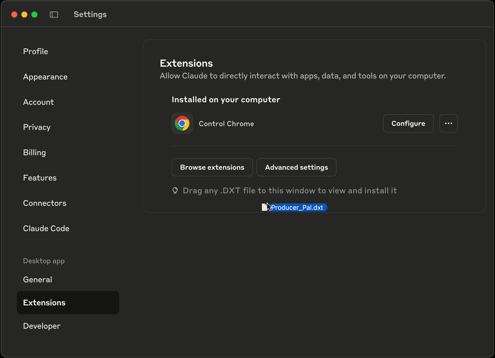

# Producer Pal

Make music in Ableton Live with an AI assistant such as
[Anthropic Claude](https://www.anthropic.com/claude).

## Requirements

- [Ableton Live 12.2+](https://www.ableton.com/live/) with
  [Max for Live](https://www.ableton.com/live/max-for-live/) (e.g. Ableton Live
  Suite edition)
- [Claude Desktop](https://claude.ai/download) (or another
  [MCP-compatible](https://modelcontextprotocol.io/) AI chat client like Claude
  Code or VS Code)

## Installing

1. Download the latest version:
   - [Producer-Pal.amxd](https://github.com/adamjmurray/producer-pal/releases/latest/download/Producer-Pal.amxd) -
     the Max for Live device
   - [Producer-Pal.dxt](https://github.com/adamjmurray/producer-pal/releases/latest/download/Producer-Pal.dxt) -
     the Claude Desktop extension

2. Add
   [Producer-Pal.amxd](https://github.com/adamjmurray/producer-pal/releases/latest/download/Producer-Pal.amxd)
   to an Ableton Live project

   

3. Open Claude Desktop &rarr; Settings &rarr; Extensions. Drag and drop
   [Producer-Pal.dxt](https://github.com/adamjmurray/producer-pal/releases/latest/download/Producer-Pal.dxt)
   into it:

   

4. Don't forget to click "Install"

   

5. You should see 15 Producer Pal tools in Claude's "Search and Tools" menu

   

6. Start a conversation with "Let's play with Ableton Live"

   

See
[the latest release](https://github.com/adamjmurray/producer-pal/releases/latest/)
for more info on this version.

## Support and Issues

- **Bug Reports**:
  [GitHub Issues](https://github.com/adamjmurray/producer-pal/issues) (please do
  not send pull requests)
- **Documentation**:
  [GitHub Homepage (this page)](https://github.com/adamjmurray/producer-pal/#producer-pal)
  and [the dedicated area of my website](https://adammurray.link/producer-pal/)
- **Community**:
  [GitHub Discussions](https://github.com/adamjmurray/producer-pal/discussions)

## ⚠️ Important Notices

**🧪 EXPERIMENTAL SOFTWARE**: Always save and backup your Live sets before use.
The software may cause crashes, data loss, or unexpected behavior.

**🔒 PRIVACY**: Your musical data (MIDI notes, track names, tempo, etc.) is
transmitted to Anthropic's Claude AI service for processing. Review
[Anthropic's privacy policy](https://www.anthropic.com/privacy). Do not use with
confidential or commercially sensitive musical content.

**💰 USAGE COSTS**: While the Producer Pal itself is free, it requires Claude
AI. Claude's free and subscription accounts have usage limits (recommended:
avoid Opus and "extended thinking" mode on free and Pro accounts). Using API
keys instead of subscription access costs money for every interaction.

## Usage

### Basic Examples

- Start a chat like:

  > let's play with Ableton Live

  or simply:

  > ableton

- If Ableton Live or the Producer Pal Max for Live device aren't running, the AI
  will let you know. Once it's running, say:

  > try again

- Setup a drum rack in a track called "Drums" and ask:

  > find the drums track and generate a 4-bar drum loop

  then:

  > I like that, make some variations

  or:

  > great! can you expand that to 16 bars?

  or:

  > it's pretty repetitive, can you add some drum fills on the last few beats?

  or:

  > meh, that's not very good. do something more like ...

  the better you can describe exactly what you want, the better the results
  should be.

- Setup some pads or keys in a track called "Chords" and ask:

  > in the chords track, generate a 4-chord progression of whole notes in C
  > minor

- Then (with a "Bass" track):

  > in the bass track, generate a bassline to go along with that chord
  > progression

- Let the AI tell you what else it can do:

  > what are all the things you can do with your Ableton Live tools?

### Session and Arrangement views

Producer Pal understands how to use both the Session view and the Arrangement
view of Ableton Live. Use Session view for idea generation and jamming, and if
you like the results, you can ask Producer Pal to help lay it out as a song in
Arrangement view. Or open existing Session-based projects and get help turning
them into full songs. Feel free to jump directly to Arrangement view if that's
your preference for new projects.

### Limitations

Producer Pal is focused on generating and manipulating MIDI clips.

It cannot (yet) manage devices (instruments or effects) in your tracks. You must
add and adjust all devices yourself. Note that it can duplicate tracks,
including all the track's devices.

It cannot work with audio clips beyond some general features like deleting and
duplicating clips (it cannot add new audio clips or create audio from scratch).

Although Drum Racks are supported in arbitrary instrument rack structures
(nested at any depth, in any chain position), tracks with multiple Drum Racks
have a limitation: only the first Drum Rack found during device traversal will
populate the drum map (which tells the AI which pitches correspond to which drum
sounds). Subsequent Drum Racks on the same track are ignored. To ensure
predictable drum programming, avoid using multiple Drum Racks within a single
track when working with Producer Pal.

### Known Issues

- Using the Producer Pal in an Ableton Live template may cause Ableton to crash
  when loading that template. You may need to
  [reset your default Live template](https://help.ableton.com/hc/en-us/articles/209773265-Troubleshooting-a-crash#h_01HCFQ56MG8QVWC78FWANX5KWP)
  if you save Producer Pal into it. I will try to work with Ableton to get this
  crash solved eventually, but in the meantime it's recommended you do not save
  Producer Pal into Ableton Live templates. (Saving and opening normal projects
  seems fine.)

### Advanced Examples

Above are some basic ideas to get you started. For best results, be very
specific and detailed about what you want. Instead of "generate a melody", try:

> Generate an 8-bar EDM-style synthesizer melody in the key of C major with a
> mix of whole notes, half notes, quarter notes, and eighth notes. Use some
> dotted rhythms and syncopation too. Keep the center of the melody around the C
> above middle C.

If you don't know enough about music theory to ask for things like this, try
asking the AI for help learning music theory. Or just describe it the best you
can and chat back and forth as needed to clarify. Find your own way to interact
with it based on your unique perspective. For example, if you aren't sure how to
ask for specific aspects of a melody, you could ask things like "What makes a
good melody in [some genre]?", chat about that topic, and then ask "Show me an
example of a melody like that in the lead track in Ableton Live". It can be very
powerful to ask the AI to perform web searches and do research during these
types of conversations.

## Tips

For a full feature reference see [FEATURES.md](./FEATURES.md).

**Always keep backups and save often!** Don't let AI loose on a serious song you
care about unless you've saved a backup copy. Producer Pal can overwrite and
delete things. If you make good progress, save it before you lose it.

Producer Pal can't read your mind, so if it doesn't do what you wanted, try to
clearly tell it what it did wrong and what you wanted instead. Assuming it has
the functionality, it can often correct itself with clear feedback. If it
doesn't have the functionality, it should be able to explain its limitations and
help set your expectations.

If Claude is making mistakes or you are asking for something particularly
complex, try the "extended thinking" feature. This works with both the Sonnet
and Opus models. Note this is probably overkill most of the time and will reach
usage limits faster, so it's recommended to leave it off until you need it.

Keep your context window small for best results. In practical terms, that means:
If you have a very long conversation, consider starting a new conversation.
Claude can easily re-read the state of Ableton Live in a new conversation (just
say "Let's play with Ableton Live" again). If you want to maintain context from
the old conversation, ask Claude to summarize the current conversation and copy
and paste the summary into a new conversation.

To help keep your context window small, it's recommended to use standalone
conversations by default and not use a Claude Project. However, you may find
value in setting up a focused Claude Project for specific musical goals, for
example, by specifying some music theory rules in the Claude Project
instructions or knowledge base.

## Producer Pal's Mission

- Supplement, complement, enhance, and amplify human creativity. Don't replace
  human creativity!

- Help people get unblocked when they're creatively blocked.

- Make it easier to experiment with music in terms of high level ideas instead
  of the low level piano roll events.

- Facilitate life-long learning by teaching people things they didn't know about
  music theory, composition, and arrangement.

- Help people with disabilities produce music (assuming Claude Desktop or an
  alternative chat client can be used in a hands-free voice mode, this should be
  possible)
