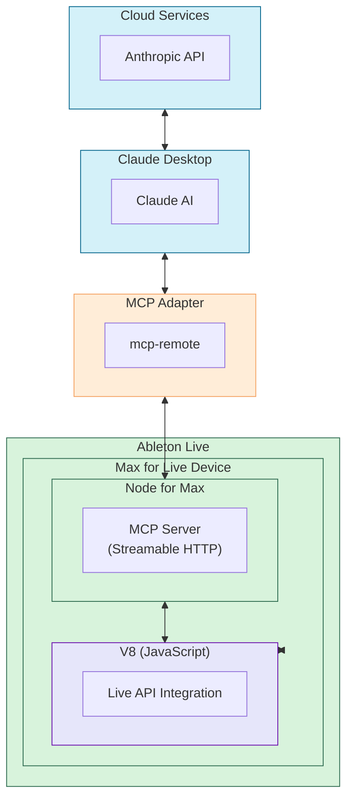

```mermaid
flowchart TB
    subgraph cloud["Cloud Services"]
        api["Anthropic API"]
    end

    subgraph host["Claude Desktop"]
        claude["Claude AI"]
    end

    subgraph adapter["MCP Adapter"]
        mcpremote["mcp-remote"]
    end

    subgraph ableton["Ableton Live"]
        subgraph m4l["Max for Live Device"]
            direction LR
            subgraph node["Node for Max"]
                server["MCP Server\n(Streamable HTTP)"]
            end

            subgraph v8["V8 (JavaScript)"]
                liveapi["Live API Integration"]
            end
        end
    end

    cloud <--> host
    host <--> adapter
    adapter <--> node
    node <--> v8
    v8 <--> ableton

    classDef blue fill:#D4F1F9,stroke:#05668D
    classDef green fill:#D8F3DC,stroke:#2D6A4F
    classDef orange fill:#FFEDD8,stroke:#F4A261
    classDef purple fill:#E6E6FA,stroke:#6A0DAD

    class host,cloud blue
    class adapter orange
    class ableton,m4l,node green
    class v8 purple
```
